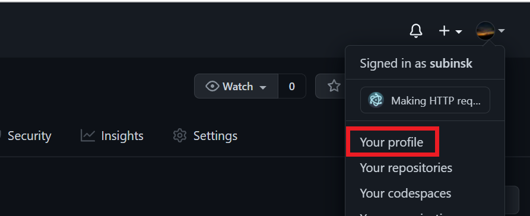

# CommOS-firstcontribution

## How to make contribution
1. Fork this repo
2. Clone this repo in your local system
3. Add your **Name** and **Github Profile** Link as the below format:
```md
| Your Name | Your GitHub Profile Link |
```

4. Commit and make a pull request to the main repo
5. Done 🎉

#### To get your profile link, click this button

Then, copy the link of the address bar, that is your **GitHub Profile Link**.

## Members of this CommOS: Hacktoberfest'21

| Name | GitHub Profile Link |
|--|--|
|Ayush Tripathi | https://github.com/AyushTripathiIITP |
| Subin S K | https://github.com/subinsk |
| Harshit Paneri | https://github.com/harshit-paneri |
| Sourin | https://github.com/Souronix44 |
| Suman Sharma | https://github.com/CrackerSuman |
| Rishiraj Chauhan | https://github.com/rishiraj52 |
| Anuruddh Marskole | https://github.com/kumar21-crypto |
| Deepa S | https://github.com/deepu13 |
| Priyanshu Vaishnavi | https://github.com/priyanshu688 |
| Pranjal | https://github.com/pranjal698 |
| Naman Sharma | https://github.com/Naman-sharma00100 |
| Nishant Suthar | https://github.com/nik25s |
| Charchit Agarwal | https://github.com/charchit-agarwal |
| Garvit Chouhan| https://github.com/Garvit9000c |
| Jash Hinger | https://github.com/jash458 |
| Saumya | https://github.com/Saumya008 |
| Urvashi Parashar | https://github.com/urvashiparashar |
| Chaitanya Agarwal | https://github.com/Slammer21 |
| Atishay | https://github.com/jnatishay78 |
| Zainab Attari | https://github.com/Zainab-A |
